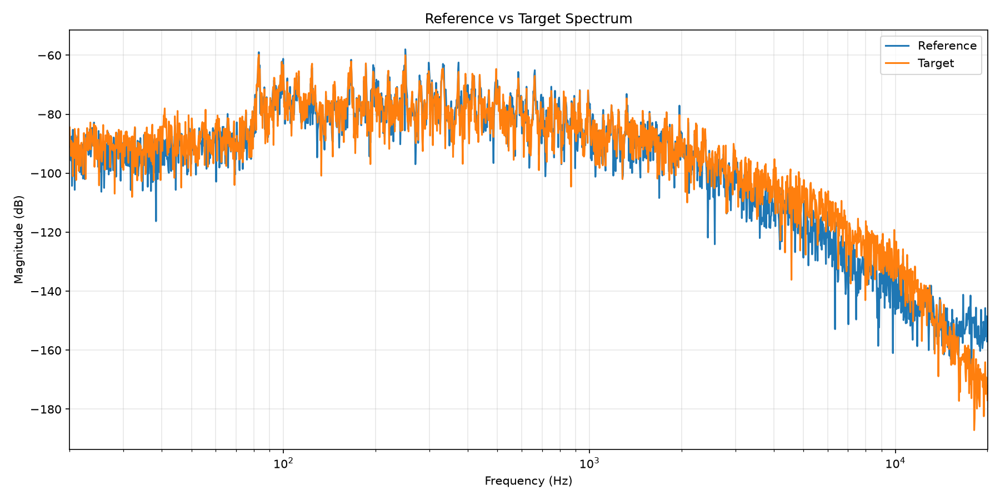
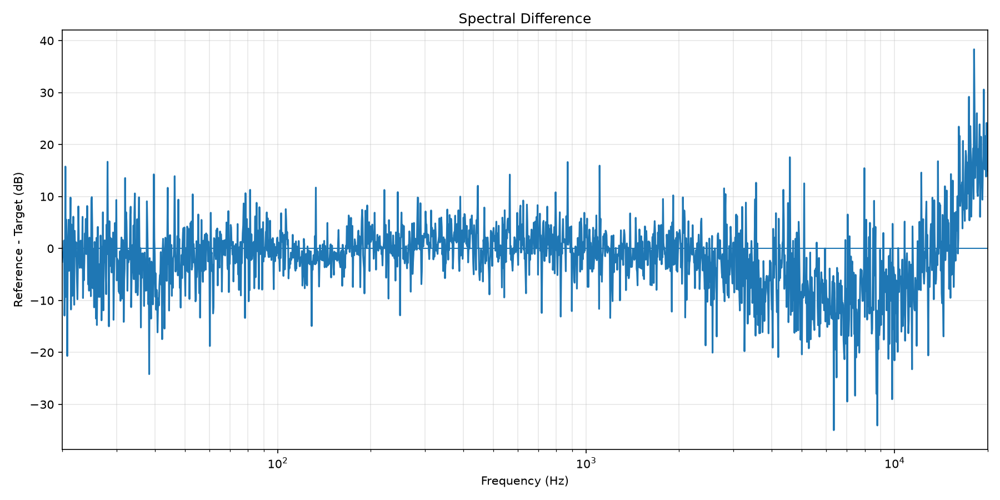

# Reference Benchmark Report

**Reference:** Clean DI
**Target:** Our Amp Sim

---

## Audio Information

- Sample Rate: 44100 Hz
- Samples: 8234884
- Duration: 186.73 sec

## Latency / Alignment

- Candidate Latency: -2 samples (-0.0454 ms)
- Alignment Applied: False
- Accepted Latency: 0 samples (0.0000 ms)
- Correlation Before: 0.862447
- Correlation After: 0.862447

## Level / Dynamics

| Metric | Reference | Target |
|---|---:|---:|
| Peak | 0.726593 | 0.153802 |
| RMS | 0.039888 | 0.039888 |
| Crest Factor | 25.21 dB | 11.72 dB |

RMS Match Gain: `0.392294`

## Time Domain Comparison

- MAE: 0.012185
- RMSE: 0.020997
- Correlation: 0.862447

## Frequency Domain Comparison

- Spectral MAE: 5.550 dB
- Spectral RMSE: 6.629 dB
- Spectral Correlation: 0.983644

## Frequency Band Analysis

> Difference = Reference - Target

| Band | Range | Difference | MAE | Interpretation |
|---|---:|---:|---:|---|
| Sub | 20–80 Hz | -1.601 dB | 1.795 dB | Target higher by 1.60 dB |
| Bass | 80–200 Hz | -0.997 dB | 1.201 dB | Target higher by 1.00 dB |
| Low Mid | 200–500 Hz | +0.353 dB | 0.620 dB | Similar |
| Mid | 500–2000 Hz | -0.049 dB | 0.712 dB | Similar |
| High Mid | 2000–5000 Hz | -4.810 dB | 4.813 dB | Target higher by 4.81 dB |
| Presence | 5000–8000 Hz | -9.340 dB | 9.340 dB | Target higher by 9.34 dB |
| High | 8000–20000 Hz | -5.210 dB | 5.609 dB | Target higher by 5.21 dB |

## Visualization

### Spectrum

### Spectral Difference

## Notes

- Positive difference means the Target is lower than the Reference in that frequency band.
- Negative difference means the Target is higher than the Reference in that frequency band.
- RMS level matching is applied before comparison.
- Spectral measurements use Welch averaged spectra.
- Correlation and error values are comparison metrics, not direct audio-quality scores.
